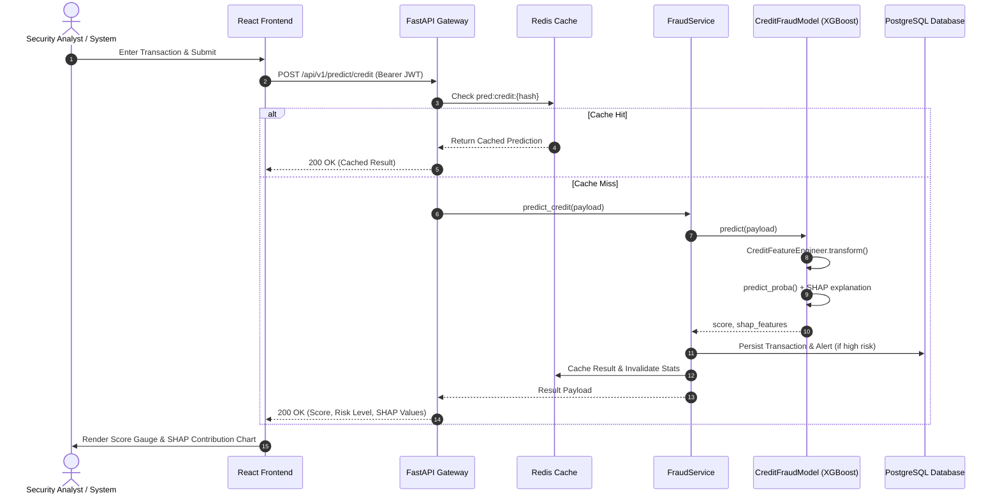

# 🛡️ Detexa — System Architecture Documentation

> **Version:** 2.0.0  
> **Architecture Pattern:** Decoupled Monorepo (FastAPI Backend + React/TypeScript Frontend)  
> **Last Updated:** 2026-10-06  

---

## 📋 Table of Contents
1. [Overview & Restructuring Summary](#1-overview--restructuring-summary)
2. [Project Directory Layout](#2-project-directory-layout)
3. [Backend Architecture (`backend/`)](#3-backend-architecture-backend)
   - [3.1 Layered Architecture Pattern](#31-layered-architecture-pattern)
   - [3.2 API Routing & Endpoints](#32-api-routing--endpoints)
   - [3.3 Machine Learning Inference & SHAP Engine](#33-machine-learning-inference--shap-engine)
   - [3.4 Database Models & Schema](#34-database-models--schema)
   - [3.5 Redis In-Memory Caching](#35-redis-in-memory-caching)
   - [3.6 Authentication & Security](#36-authentication--security)
4. [Frontend Architecture (`frontend/`)](#4-frontend-architecture-frontend)
   - [4.1 Component Hierarchy & Layout](#41-component-hierarchy--layout)
   - [4.2 State & Context Management](#42-state--context-management)
   - [4.3 API Client & Interceptors](#43-api-client--interceptors)
   - [4.4 Data Visualization & Views](#44-data-visualization--views)
5. [Data Flow Diagrams](#5-data-flow-diagrams)
6. [Containerization & Local Execution](#6-containerization--local-execution)

---

## 1. Overview & Restructuring Summary

Detexa has been restructured into a modular, production-ready full-stack platform consisting of two dedicated subsystems:
- **`backend/`**: High-performance FastAPI REST server, asynchronous business logic services layer, SQLAlchemy ORM with PostgreSQL/SQLite compatibility, Redis caching layer, and serialized XGBoost/Isolation Forest ML inference pipelines.
- **`frontend/`**: Modern Single Page Application (SPA) built with React 18, TypeScript, Tailwind CSS, Vite, Lucide Icons, and Recharts.

### Key Architectural Improvements in v2.0.0
- **Streamlit Replaced with React + TypeScript:** The legacy Streamlit frontend has been completely eliminated in favor of a responsive, performant React SPA with client-side routing, JWT interceptors, and rich visualizations.
- **Resolved Frontend Auth Bug:** API requests now consistently transmit Bearer JWT authentication tokens via centralized Axios interceptors.
- **Dynamic SHAP Feature Explanations:** Resolved the feature name caching defect in `CreditFeatureEngineer`, restoring explicit feature labels (`V14`, `Amount`, `V1_V2_interaction`, `v_norm`) in SHAP charts.
- **Integrated Redis Caching:** Implemented non-blocking Redis caching for dashboard statistics and prediction deduplication.
- **Strict Separation of Concerns:** Database entities, Pydantic transfer schemas, ML pipelines, service orchestrators, and HTTP endpoints are strictly decoupled with no duplicate logic.

---

## 2. Project Directory Layout

```
detexa/
├── backend/                          # FastAPI + Python Backend
│   ├── alembic/                      # Database migration configurations
│   │   ├── versions/                 # Revision scripts
│   │   └── env.py                    # Alembic runtime environment
│   ├── app/                          # Core application package
│   │   ├── api/                      # Routing & dependency injection
│   │   │   ├── deps.py               # Auth & DB dependencies
│   │   │   └── v1/                   # API Version 1 endpoints
│   │   │       ├── api.py            # Aggregator router
│   │   │       └── endpoints/        # Resource routers (auth, predict, alerts, etc.)
│   │   ├── core/                     # Cross-cutting concerns
│   │   │   ├── config.py             # Pydantic Settings v2
│   │   │   ├── logging.py            # Loguru structured logger
│   │   │   ├── redis.py              # Redis client & caching utilities
│   │   │   └── security.py           # Password hashing & JWT helpers
│   │   ├── db/                       # Persistence layer
│   │   │   ├── base.py               # ORM entity registration
│   │   │   ├── models.py             # SQLAlchemy 2.0 ORM models
│   │   │   └── session.py            # Database engine & session maker
│   │   ├── ml/                       # Machine Learning layer
│   │   │   ├── models/               # Model inference singletons & SHAP
│   │   │   ├── pipelines/            # Sklearn feature transformers
│   │   │   └── saved/                # Serialized .pkl pipelines
│   │   ├── models/                   # Request/Response validation schemas
│   │   │   └── schemas.py            # Pydantic v2 schemas
│   │   ├── services/                 # Business logic orchestration
│   │   │   ├── alert_service.py      # Alert triage & KPI metrics
│   │   │   ├── auth_service.py       # User authentication & registration
│   │   │   ├── behavior_service.py   # Behavioral anomaly orchestration
│   │   │   ├── fraud_service.py      # Credit fraud scoring & auditing
│   │   │   └── transaction_service.py# Transaction querying & search
│   │   └── main.py                   # ASGI application factory & lifespan
│   ├── data/                         # Datasets (creditcard.csv)
│   ├── scripts/                      # Operational utilities
│   │   ├── seed_data.py              # Synthetic database seeder
│   │   └── train_models.py           # ML training script
│   ├── tests/                        # Integration & unit tests
│   │   └── test_api.py               # FastAPI test client suite
│   ├── .env.example                  # Backend environment template
│   ├── alembic.ini                   # Alembic configuration
│   ├── Dockerfile                    # Multi-stage backend container image
│   └── requirements.txt              # Pinned Python dependencies
│
├── frontend/                         # React + TypeScript Frontend
│   ├── public/                       # Static public assets
│   │   └── favicon.svg               # Application icon
│   ├── src/                          # TypeScript source code
│   │   ├── assets/                   # Images and styling assets
│   │   ├── components/               # Reusable UI components
│   │   │   ├── common/               # StatCard, ScoreGauge, SHAPChart, RiskBadge
│   │   │   └── layout/               # Navbar, Sidebar, MainLayout
│   │   ├── context/                  # React Context providers (Auth, Theme)
│   │   ├── pages/                    # Route views
│   │   │   ├── AlertsPage.tsx        # Alert triage and status management
│   │   │   ├── BehaviorPage.tsx      # Behavioral analytics & telemetry
│   │   │   ├── LandingPage.tsx       # Marketing landing page
│   │   │   ├── LoginPage.tsx         # Sign-in page with demo autofill
│   │   │   ├── OverviewPage.tsx      # Executive dashboard KPIs & charts
│   │   │   ├── PredictPage.tsx       # Interactive scoring & batch CSV upload
│   │   │   ├── RegisterPage.tsx      # User registration page
│   │   │   └── TransactionsPage.tsx  # Filterable transaction table & CSV export
│   │   ├── services/                 # API client & backend service adapters
│   │   │   ├── api.ts                # Axios instance with auth interceptors
│   │   │   ├── alert.service.ts      # Alert endpoints
│   │   │   ├── auth.service.ts       # Auth endpoints
│   │   │   ├── behavior.service.ts   # Behavior endpoints
│   │   │   ├── predict.service.ts    # Prediction endpoints
│   │   │   └── transaction.service.ts# Transaction endpoints
│   │   ├── types/                    # TypeScript interfaces & enums
│   │   │   └── index.ts              # Data contracts
│   │   ├── App.tsx                   # Root router & protected route guards
│   │   ├── index.css                 # Tailwind directives & base styles
│   │   └── main.tsx                  # React application entry point
│   ├── .env.example                  # Frontend environment template
│   ├── Dockerfile                    # Node.js preview container image
│   ├── index.html                    # HTML entry point
│   ├── package.json                  # Node.js dependencies & scripts
│   ├── postcss.config.js             # PostCSS Tailwind plugin
│   ├── tailwind.config.js            # Tailwind color & layout tokens
│   ├── tsconfig.json                 # TypeScript compiler configuration
│   └── vite.config.ts                # Vite bundler configuration
│
├── docs/                             # Project documentation
│   ├── ARCHITECTURE.md               # Current system architecture
│   └── INSPECTION_REPORT.md          # Comprehensive pre-restructure report
└── docker-compose.yml                # Full-stack container orchestration
```

---

## 3. Backend Architecture (`backend/`)

### 3.1 Layered Architecture Pattern

```
┌────────────────────────────────────────────────────────┐
│                   HTTP Requests (Clients)              │
└───────────────────────────┬────────────────────────────┘
                            │
┌───────────────────────────▼────────────────────────────┐
│                    api/v1/endpoints/                   │  <- Routing, Auth Guards, Payload Parsing
└───────────────────────────┬────────────────────────────┘
                            │
┌───────────────────────────▼────────────────────────────┐
│                       services/                        │  <- Business Logic, Caching, Workflow
└──────────────┬───────────────────────────┬─────────────┘
               │                           │
┌──────────────▼─────────────┐ ┌───────────▼─────────────┐
│          db/models         │ │         ml/models       │  <- Storage Models & Model Inference
└────────────────────────────┘ └─────────────────────────┘
```

1. **API Layer (`app/api/`):** Thin controller layer responsible for input extraction, dependency resolution, response schema validation, and status code dispatch.
2. **Service Layer (`app/services/`):** Encapsulates all domain business logic, transactional database modifications, Redis caching operations, and model invocation.
3. **Machine Learning Layer (`app/ml/`):** Model singleton lifecycles, scikit-learn preprocessing pipelines, and SHAP explainability calculations.
4. **Persistence Layer (`app/db/`):** SQLAlchemy ORM models, connection pooling, and session life-cycle generators.

### 3.2 API Routing & Endpoints

All application routes are prefixed with `/api/v1`:

| Router | Method | Path | Auth | Description |
| :--- | :--- | :--- | :--- | :--- |
| **Auth** | `POST` | `/api/v1/auth/register` | Public | Registers a user and returns a JWT |
| **Auth** | `POST` | `/api/v1/auth/login` | Public | Authenticates credentials and issues a JWT |
| **Auth** | `GET` | `/api/v1/auth/me` | User | Returns the authenticated user profile |
| **Auth** | `GET` | `/api/v1/auth/users` | Admin | Lists registered user accounts |
| **Auth** | `PUT` | `/api/v1/auth/users/{id}/status` | Admin | Activates/deactivates user accounts |
| **Predict** | `POST` | `/api/v1/predict/credit` | User | Real-time card fraud scoring with SHAP |
| **Predict** | `POST` | `/api/v1/predict/credit/batch` | User | Parallel batch transaction scoring |
| **Predict** | `POST` | `/api/v1/predict/behavior` | User | Behavioral anomaly detection score |
| **Alerts** | `GET` | `/api/v1/alerts` | User | Filterable, paginated alert list |
| **Alerts** | `GET` | `/api/v1/alerts/stats` | User | High-level dashboard aggregate counts |
| **Alerts** | `GET` | `/api/v1/alerts/{id}` | User | Single alert detail inspection |
| **Alerts** | `PUT` | `/api/v1/alerts/{id}/status` | User | Updates alert triage status |
| **Transactions** | `GET` | `/api/v1/transactions` | User | Filterable transaction ledger |
| **Transactions** | `GET` | `/api/v1/transactions/{id}` | User | Single transaction detail record |
| **Behavior** | `GET` | `/api/v1/behavior/logs` | User | Raw session activity logs |
| **Behavior** | `GET` | `/api/v1/behavior/stats` | User | Aggregate behavioral metrics |
| **System** | `GET` | `/health` | Public | Liveness health check |
| **System** | `GET` | `/health/ready` | Public | Readiness probe (DB + Redis check) |

### 3.3 Machine Learning Inference & SHAP Engine

- **Supervised Credit Fraud Model (`CreditFraudModel`):**
  - Uses an XGBoost classifier trained on SMOTE-oversampled card transactions.
  - Generates derived features: $\log(1 + \text{amount})$, $\text{amount}^2$, interaction terms ($V_1 \times V_2$, $V_3 \times V_4$, $V_{14} \times V_{17}$), and the $L_2$ norm across all $V_i$ components.
  - `CreditFeatureEngineer` automatically caches feature names in `_feature_names_cache` to allow `shap.TreeExplainer` to compute exact feature attribution scores for every inference call.
- **Unsupervised Anomaly Model (`BehaviorAnomalyModel`):**
  - Isolation Forest model evaluating session features: `login_hour`, `typing_speed`, `mouse_velocity`, `is_vpn`, `is_tor`, `failed_logins`, `device_change`.
  - Normalizes raw Isolation Forest scores into a $[0, 1]$ anomaly probability.

### 3.4 Database Models & Schema

The PostgreSQL schema is structured across five primary entities:
- **`users`**: User identities, bcrypt password hashes, and admin privilege flags.
- **`transactions`**: Raw PCA components ($V_1..V_{28}$), transaction metadata, fraud scores, and risk classifications.
- **`behavior_logs`**: Session telemetry, client IP, device fingerprints, and calculated anomaly scores.
- **`alerts`**: Raised security events with risk triage status (`open`, `reviewed`, `resolved`, `false_positive`) and serialized SHAP feature values.
- **`prediction_logs`**: Immutable audit logs containing inference latency, endpoint metadata, and input SHA-256 hashes.

### 3.5 Redis In-Memory Caching

- Integrated in `app/core/redis.py` with graceful fallback if Redis is offline.
- **Key Cache Patterns:**
  - `stats:dashboard` (TTL: 30s): Caches aggregate KPI counts for the overview page.
  - `pred:credit:<input_hash>` (TTL: 300s): Deduplicates and caches credit card prediction responses.
  - Automatic invalidation of `stats:*` upon creation of new transactions or alert status updates.

### 3.6 Authentication & Security

- **Tokens:** Bearer JWT tokens signed with HMAC-SHA256 (`HS256`).
- **Passwords:** Hashed using Passlib bcrypt with salt generation.
- **Authorization:** `get_current_user` and `get_current_admin` FastAPI dependencies enforce identity and role access control across all protected endpoints.

---

## 4. Frontend Architecture (`frontend/`)

### 4.1 Component Hierarchy & Layout

```
App.tsx (Router + Providers)
├── ThemeProvider (Dark/Light mode state)
└── AuthProvider (JWT, session persistence, user state)
    └── MainLayout
        ├── Navbar (Brand, Theme Toggle, Profile Badge, Logout)
        ├── Sidebar (Platform Navigation Links)
        └── Route Outlet (Page Components)
            ├── OverviewPage (KPI Cards, Charts, Recent Alerts)
            ├── TransactionsPage (Search, Filters, Data Table, CSV Export)
            ├── AlertsPage (Triage Selector, Risk Filters, Timeline)
            ├── PredictPage (Single Form, Batch CSV Upload, SHAP Chart)
            └── BehaviorPage (Telemetry Metrics, Country Bars, Logs Table)
```

### 4.2 State & Context Management

- **`AuthContext` (`src/context/AuthContext.tsx`):**
  - Manages JWT access token in `localStorage`.
  - Handles authentication state, login, user registration, and automatic logout on token expiry.
- **`ThemeContext` (`src/context/ThemeContext.tsx`):**
  - Manages dark mode class toggling on `document.documentElement` with `localStorage` persistence.

### 4.3 API Client & Interceptors

- Centralized in `src/services/api.ts` using Axios.
- **Request Interceptor:** Automatically injects `Authorization: Bearer <token>` into all outgoing API requests.
- **Response Interceptor:** Intercepts `401 Unauthorized` responses and redirects unauthenticated users to `/login`.

### 4.4 Data Visualization & Views

- Built using **Recharts**:
  - `BarChart`: Daily transaction volume and sessions by country.
  - `PieChart`: Risk distribution donuts.
  - `AreaChart`: Alert frequency timeline.
  - `SHAPChart`: Horizontal bar chart mapping individual feature contribution values.
  - Custom SVG `ScoreGauge`: Smooth animated gauge rendering risk probabilities.

---

## 5. Data Flow Diagrams

### Prediction & Alert Generation Flow



---

## 6. Containerization & Local Execution

### Multi-Container Deployment via Docker Compose

```yaml
# Runs 4 integrated services:
# - postgres (Port 5432)
# - redis (Port 6379)
# - backend (Port 8000)
# - frontend (Port 5173)
docker compose up --build
```

### Manual Local Development Setup

#### 1. Start Backend (Terminal 1)
```bash
cd backend
python -m venv .venv
source .venv/bin/activate  # Windows: .venv\Scripts\activate
pip install -r requirements.txt
python scripts/seed_data.py
uvicorn app.main:app --reload --host 0.0.0.0 --port 8000
```

#### 2. Start Frontend (Terminal 2)
```bash
cd frontend
npm install
npm run dev
```

- **Frontend URL:** `http://localhost:5173`
- **Backend API Docs:** `http://localhost:8000/docs`
- **Default Admin Login:** `admin@detexa.io` / `Admin@1234`

---
*Documentation generated for Detexa v2.0.0.*
